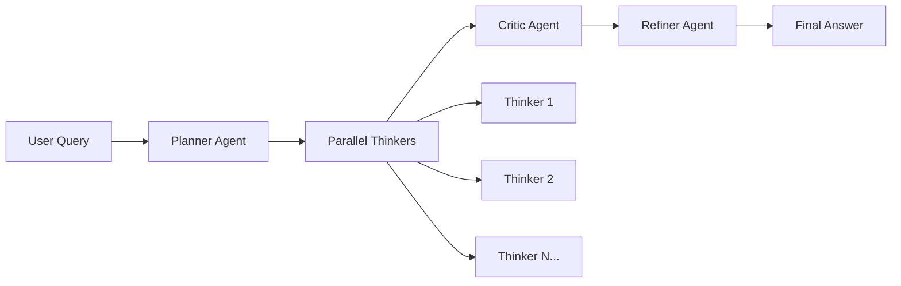

# Open Deep Think 🧠

An open-source orchestration layer that replicates Google's Gemini 2.5 Deep Think capabilities using the publicly available gemini-2.5-pro API endpoint.

[](https://github.com/your-repo/open-deep-think)
[](https://python.org)
[](https://fastapi.tiangolo.com)
[](https://streamlit.io)

## 🎯 Overview

Open Deep Think implements a sophisticated parallel thinking → critique → refinement pipeline that mimics Google's Gemini Deep Think mode. The system generates multiple concurrent reasoning paths, evaluates them through an advanced critique system, and synthesizes the best elements into comprehensive final answers.

## 🏗️ Architecture



### Core Components

- **🎯 Planner Agent**: Analyzes queries and creates structured thinking plans
- **🧠 Thinker Agents**: Generate diverse reasoning paths in parallel (2-16 paths)
- **⚖️ Critic Agent**: Evaluates and scores all candidates across multiple dimensions
- **✨ Refiner Agent**: Synthesizes top candidates into polished final answers

## 🚀 Quick Start

### Prerequisites

- Python 3.11+
- Gemini API key ([Get one here](https://makersuite.google.com/app/apikey))

### 1. Environment Setup

```bash
# Clone the repository
git clone <your-repo-url>
cd DeepThinker

# Create virtual environment
python3 -m venv venv
source venv/bin/activate  # On Windows: venv\Scripts\activate

# Install dependencies
pip install -r requirements.txt
```

### 2. Configuration

```bash
# Copy environment template
cp .env.example .env

# Edit .env file and add your API key
echo "GEMINI_API_KEY=your_actual_api_key_here" > .env
```

### 3. Start the System

#### Option A: Backend + Frontend (Recommended)

**Terminal 1 - Start Backend:**
```bash
source venv/bin/activate
python scripts/start_server.py
```

**Terminal 2 - Start Frontend:**
```bash
source venv/bin/activate
python scripts/start_frontend.py
```

Then open: **http://localhost:8501**

#### Option B: Backend Only

```bash
source venv/bin/activate
uvicorn app.main:app --reload
```

API available at: **http://localhost:8000**

### 4. Test the System

#### Via Web Interface
- Open http://localhost:8501
- Enter your question
- Adjust parameters (thinking paths, timeout, etc.)
- Click "🧠 Think Deep"

#### Via CLI
```bash
source venv/bin/activate
python scripts/cli_test.py
```

#### Via API
```bash
curl -X POST http://localhost:8000/think \
     -H "Content-Type: application/json" \
     -d '{"query": "Explain quantum entanglement", "n_paths": 4, "top_k": 3}'
```

## 📁 Project Structure

```
DeepThinker/
├── 📁 app/                    # FastAPI application
│   ├── main.py               # Main application entry point
│   ├── config.py             # Configuration management
│   └── dependencies.py       # Dependency injection
├── 📁 agents/                 # Agent implementations
│   ├── base.py               # Base agent class
│   ├── planner.py            # Query analysis and planning
│   ├── thinker.py            # Parallel reasoning paths
│   ├── critic.py             # Evaluation and scoring
│   └── refiner.py            # Synthesis and refinement
├── 📁 orchestrator/           # Pipeline orchestration
│   └── pipeline.py           # Main Deep Think pipeline
├── 📁 clients/                # External API clients
│   └── gemini.py             # Gemini API client with retry logic
├── 📁 models/                 # Pydantic data models
│   ├── request.py            # API request models
│   └── response.py           # API response models
├── 📁 prompts/                # Agent prompt templates
│   ├── planner.txt           # Planning prompts
│   ├── thinker.txt           # Thinking prompts
│   ├── critic.txt            # Critique prompts
│   └── refiner.txt           # Refinement prompts
├── 📁 frontend/               # Streamlit web interface
│   ├── streamlit_app.py      # Main frontend application
│   └── requirements.txt      # Frontend dependencies
├── 📁 scripts/                # Utility scripts
│   ├── start_server.py       # Backend server launcher
│   ├── start_frontend.py     # Frontend launcher
│   └── cli_test.py           # CLI testing tool
└── 📁 tests/                  # Test suite
```

## 🛠️ Development

### Running Tests

```bash
# Run all tests
pytest

# Run with coverage
pytest --cov=. --cov-report=html

# Run specific test
pytest tests/test_pipeline.py -v
```

### Code Quality

```bash
# Format code
black .

# Lint code  
ruff check .

# Type checking
mypy .

# Check everything
python scripts/check_quality.py
```

### Adding New Agents

1. Create new agent in `agents/` inheriting from `BaseAgent`
2. Add prompt template in `prompts/`
3. Register in pipeline configuration
4. Add tests in `tests/`

## ⚙️ Configuration

### Environment Variables

| Variable | Description | Default |
|----------|-------------|---------|
| `GEMINI_API_KEY` | Your Gemini API key | **Required** |
| `DEFAULT_N_PATHS` | Parallel thinking paths | `4` |
| `DEFAULT_TOP_K` | Top candidates for synthesis | `3` |
| `PIPELINE_TIMEOUT` | Max execution time (seconds) | `120` |
| `GEMINI_TIMEOUT` | API request timeout | `30` |
| `DEBUG` | Enable debug logging | `False` |

### Advanced Configuration

Create `config.yaml` for advanced settings:
```yaml
pipeline:
  thinking_budget: 10
  temperature_range: [0.3, 1.1]
  max_tokens:
    planner: 2048
    thinker: 3072
    critic: 3072
    refiner: 4096
```

## 📡 API Reference

### Health Check
```http
GET /health
```

### Deep Think
```http
POST /think
```

**Request:**
```json
{
  "query": "Explain the concept of consciousness",
  "n_paths": 6,
  "max_iterations": 1,
  "top_k": 3,
  "timeout": 120
}
```

**Response:**
```json
{
  "query": "Explain the concept of consciousness",
  "final_answer": "Comprehensive multi-perspective analysis...",
  "execution_time": 89.2,
  "n_paths": 6,
  "thinking_results": [...],
  "critique_result": {...},
  "refinement_result": {...}
}
```

### Metrics
```http
GET /metrics
```

## 🎯 Example Queries

### Mathematical Reasoning
- "Prove that there are infinitely many prime numbers"
- "Explain the Riemann Hypothesis and its significance"

### Scientific Concepts  
- "How does quantum entanglement work?"
- "What is the mechanism behind photosynthesis?"

### Philosophical Questions
- "What is the nature of consciousness?"
- "How do we define free will?"

### Complex Problem Solving
- "Design a sustainable transportation system for a city"
- "How would you approach solving climate change?"

## 📊 Performance

| Metric | Value | Notes |
|--------|-------|-------|
| **Latency** | ~100s | For 4-8 thinking paths |
| **Token Usage** | ~20-50k | Depends on complexity |
| **Throughput** | ~36 queries/hour | Gemini API rate limits |
| **Accuracy** | High | Multi-path validation |

### Optimization Tips

1. **Reduce thinking paths** for faster responses
2. **Adjust token limits** based on query complexity  
3. **Use caching** for similar queries
4. **Monitor API quotas** to avoid rate limiting

## 🐛 Troubleshooting

### Common Issues

**Backend won't start:**
```bash
# Check if port is in use
lsof -i :8000

# Kill existing processes
pkill -f uvicorn
```

**Frontend connection issues:**
```bash
# Check backend health
curl http://localhost:8000/health

# Restart with verbose logging
DEBUG=true python scripts/start_server.py
```

**API key errors:**
```bash
# Verify API key is set
echo $GEMINI_API_KEY

# Test direct API access
python scripts/test_gemini_direct.py
```

**Timeout issues:**
- Reduce `n_paths` from 8 to 4
- Increase `timeout` from 120 to 180 seconds
- Check network connectivity

## 🤝 Contributing

1. **Fork** the repository
2. **Create** a feature branch: `git checkout -b feature/amazing-feature`
3. **Commit** changes: `git commit -m 'Add amazing feature'`
4. **Push** to branch: `git push origin feature/amazing-feature`
5. **Open** a Pull Request

### Development Guidelines

- Follow PEP 8 style guidelines
- Add type hints to all functions
- Write comprehensive tests
- Update documentation
- Add logging for debugging

## 📄 License

This project is licensed under the MIT License - see the [LICENSE](LICENSE) file for details.

## 🙏 Acknowledgments

- **Google DeepMind** for the Gemini 2.5 Deep Think architecture inspiration
- **FastAPI** team for the excellent web framework
- **Streamlit** for the beautiful frontend capabilities
- **OpenAI** for setting the foundation for advanced reasoning systems

## 🔗 Links

- [Gemini API Documentation](https://ai.google.dev/docs)
- [FastAPI Documentation](https://fastapi.tiangolo.com)
- [Streamlit Documentation](https://docs.streamlit.io)
- [Project Issues](https://github.com/your-repo/issues)

---

**Built with ❤️ for advancing open-source AI reasoning capabilities**