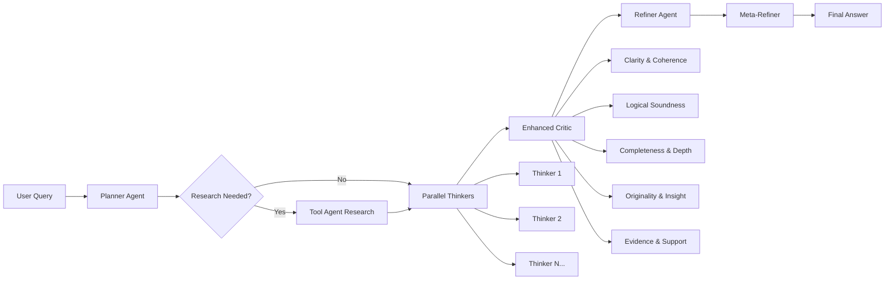

# Open Deep Think 🧠

An enhanced open-source orchestration layer that replicates and extends Google's Gemini 2.5 Deep Think capabilities using the publicly available gemini-2.5-pro API endpoint.

[](https://github.com/your-repo/open-deep-think)
[](https://python.org)
[](https://fastapi.tiangolo.com)
[](https://streamlit.io)

## 🎯 Overview

Open Deep Think implements a sophisticated **6-stage reasoning pipeline** that goes beyond Google's Gemini Deep Think mode. The system features advanced rubric-based evaluation, tool-augmented research capabilities, and meta-refinement for profound insights. It generates multiple concurrent reasoning paths, evaluates them through detailed rubrics, and synthesizes solutions through hierarchical refinement stages.

### 🆕 Enhanced Features (v2.0)

- **🔍 Grounded Reasoning**: Integrated web search capabilities for up-to-date information
- **📊 Detailed Rubric Evaluation**: 5-dimensional scoring with specific justifications  
- **🧠 Meta-Refinement**: Final synthesis stage for deeper insights and elegant reformulations
- **🛠️ Tool Integration**: Research-augmented reasoning with fallback mechanisms
- **📈 Advanced Analytics**: Elegance scoring and intellectual depth assessment

## 🏗️ Enhanced Architecture



### Enhanced Pipeline Stages

1. **🎯 Planning**: Analyzes queries and identifies research needs
2. **🔍 Research** *(conditional)*: Gathers current information via web search
3. **🧠 Parallel Thinking**: Generates diverse reasoning paths (2-16 paths) 
4. **📊 Advanced Critique**: 5-dimensional rubric evaluation with justifications
5. **✨ Synthesis**: Combines top candidates into refined solutions
6. **🌟 Meta-Refinement**: Final intellectual synthesis for profound insights

### Core Components

- **🎯 Planner Agent**: Query analysis, complexity assessment, and research planning
- **🛠️ Tool Agent**: Web search integration with Tavily API and intelligent fallbacks
- **🧠 Thinker Agents**: Parallel reasoning with research-augmented context
- **📊 Enhanced Critic**: Detailed rubric scoring across 5 evaluation dimensions
- **✨ Refiner Agent**: Multi-source synthesis with confidence assessment
- **🌟 Meta-Refiner**: Deep insight generation and elegant reformulation

## 🚀 Quick Start

### Prerequisites

- Python 3.11+
- Gemini API key ([Get one here](https://makersuite.google.com/app/apikey))

### 1. Environment Setup

```bash
# Clone the repository
git clone <your-repo-url>
cd DeepThinker

# Create virtual environment
python3 -m venv venv
source venv/bin/activate  # On Windows: venv\Scripts\activate

# Install dependencies
pip install -r requirements.txt
```

### 2. Configuration

```bash
# Copy environment template
cp .env.example .env

# Edit .env file and add your API key
echo "GEMINI_API_KEY=your_actual_api_key_here" > .env

# Optional: Add Tavily API key for enhanced web search
echo "TAVILY_API_KEY=your_tavily_api_key_here" >> .env
```

**Note**: Without Tavily API key, the system uses intelligent fallback search for testing.

### 3. Start the System

#### Option A: Backend + Frontend (Recommended)

**Terminal 1 - Start Backend:**
```bash
source venv/bin/activate
python scripts/start_server.py
```

**Terminal 2 - Start Frontend:**
```bash
source venv/bin/activate
python scripts/start_frontend.py
```

Then open: **http://localhost:8501**

#### Option B: Backend Only

```bash
source venv/bin/activate
uvicorn app.main:app --reload
```

API available at: **http://localhost:8000**

### 4. Test the System

#### Via Web Interface
- Open http://localhost:8501
- Enter your question
- Adjust parameters (thinking paths, timeout, etc.)
- Click "🧠 Think Deep"

#### Via CLI
```bash
source venv/bin/activate
python scripts/cli_test.py
```

#### Via API
```bash
curl -X POST http://localhost:8000/think \
     -H "Content-Type: application/json" \
     -d '{"query": "Explain quantum entanglement", "n_paths": 4, "top_k": 3}'
```

## 📁 Project Structure

```
DeepThinker/
├── 📁 app/                    # FastAPI application
│   ├── main.py               # Main application entry point
│   ├── config.py             # Configuration management
│   └── dependencies.py       # Dependency injection
├── 📁 agents/                 # Enhanced agent implementations
│   ├── base.py               # Base agent class with schemas
│   ├── planner.py            # Query analysis and research planning
│   ├── thinker.py            # Research-augmented parallel reasoning
│   ├── critic.py             # 5-dimensional rubric evaluation
│   ├── refiner.py            # Multi-source synthesis
│   ├── tools.py              # 🆕 Web search and tool integration
│   └── meta_refiner.py       # 🆕 Deep insight generation
├── 📁 orchestrator/           # Enhanced pipeline orchestration
│   └── pipeline.py           # 6-stage Deep Think pipeline
├── 📁 clients/                # External API clients
│   └── gemini.py             # Gemini API client with retry logic
├── 📁 models/                 # Pydantic data models
│   ├── request.py            # API request models
│   └── response.py           # Enhanced response models
├── 📁 prompts/                # Enhanced agent prompt templates
│   ├── planner.txt           # Research-aware planning prompts
│   ├── thinker.txt           # Context-augmented thinking prompts
│   ├── critic.txt            # 🆕 Detailed rubric evaluation prompts
│   ├── refiner.txt           # Multi-source synthesis prompts
│   └── meta_refiner.txt      # 🆕 Meta-refinement prompts
├── 📁 frontend/               # Streamlit web interface
│   ├── streamlit_app.py      # Enhanced frontend with new features
│   └── requirements.txt      # Frontend dependencies
├── 📁 scripts/                # Utility scripts
│   ├── start_server.py       # Backend server launcher
│   ├── start_frontend.py     # Frontend launcher
│   └── cli_test.py           # CLI testing tool
└── 📁 tests/                  # Enhanced test suite
```

## 🛠️ Development

### Running Tests

```bash
# Run all tests
pytest

# Run with coverage
pytest --cov=. --cov-report=html

# Run specific test
pytest tests/test_pipeline.py -v
```

### Code Quality

```bash
# Format code
black .

# Lint code  
ruff check .

# Type checking
mypy .

# Check everything
python scripts/check_quality.py
```

### Adding New Agents

1. Create new agent in `agents/` inheriting from `BaseAgent`
2. Add prompt template in `prompts/`
3. Register in pipeline configuration
4. Add tests in `tests/`

## ⚙️ Configuration

### Environment Variables

| Variable | Description | Default |
|----------|-------------|---------|
| `GEMINI_API_KEY` | Your Gemini API key | **Required** |
| `TAVILY_API_KEY` | Your Tavily API key for web search | *Optional* |
| `DEFAULT_N_PATHS` | Parallel thinking paths | `4` |
| `DEFAULT_TOP_K` | Top candidates for synthesis | `3` |
| `PIPELINE_TIMEOUT` | Max execution time (seconds) | `120` |
| `GEMINI_TIMEOUT` | API request timeout | `30` |
| `DEBUG` | Enable debug logging | `False` |

### 🆕 Enhanced Features Configuration

The system automatically adapts based on available capabilities:

- **With Tavily API**: Full web search capabilities for grounded reasoning
- **Without Tavily API**: Intelligent fallback search with contextual simulations
- **Research Detection**: Planner automatically identifies queries needing external data
- **Meta-Refinement**: Always enabled for deeper intellectual synthesis

### Advanced Configuration

Create `config.yaml` for advanced settings:
```yaml
pipeline:
  thinking_budget: 10
  temperature_range: [0.3, 1.1]
  max_tokens:
    planner: 2048
    thinker: 3072
    critic: 3072
    refiner: 4096
```

## 📡 API Reference

### Health Check
```http
GET /health
```

### Deep Think
```http
POST /think
```

**Request:**
```json
{
  "query": "Explain the concept of consciousness",
  "n_paths": 6,
  "max_iterations": 1,
  "top_k": 3,
  "timeout": 120
}
```

**Response:**
```json
{
  "query": "Explain the concept of consciousness",
  "answer": "Comprehensive multi-perspective analysis...",
  "metadata": {
    "execution_time_seconds": 89.2,
    "n_paths": 6,
    "research_conducted": true,
    "meta_refinement_applied": true,
    "elegance_score": 8.7,
    "intellectual_depth": "profound",
    "pipeline_stages": ["planning", "research", "thinking", "critique", "refinement", "meta_refinement"]
  },
  "detailed_results": {
    "plan": {...},
    "research": {...},
    "candidates": [...],
    "critique": {...},
    "synthesis": {...},
    "meta_refinement": {...}
  }
}
```

### Metrics
```http
GET /metrics
```

## 🎯 Example Queries

### 🔍 Research-Augmented Queries (Uses Web Search)
- "What are the latest developments in quantum computing in 2024?"
- "How have AI safety regulations evolved this year?"
- "What are current electric vehicle market trends and sales data?"

### 📊 Mathematical Reasoning  
- "Prove that there are infinitely many prime numbers"
- "Explain the Riemann Hypothesis and its significance"
- "Derive the quadratic formula from first principles"

### 🧬 Scientific Concepts
- "How does quantum entanglement work?"
- "What is the mechanism behind photosynthesis?"
- "Explain CRISPR gene editing and its ethical implications"

### 🤔 Philosophical Questions
- "What is the nature of consciousness?"
- "How do we define free will in a deterministic universe?"
- "What constitutes personal identity over time?"

### 🌍 Complex Problem Solving
- "Design a sustainable transportation system for a megacity"
- "How would you approach solving climate change holistically?"
- "Create a framework for ethical AI development"

### 🌟 Meta-Refinement Showcase
Try these to see the enhanced meta-refinement in action:
- "What is the deepest principle underlying all mathematics?"
- "How does language shape thought, and thought shape reality?"
- "What is the most elegant solution to the trolley problem?"

## 📊 Enhanced Performance

| Metric | Standard Mode | Enhanced Mode | Notes |
|--------|---------------|---------------|-------|
| **Latency** | ~60-90s | ~120-180s | 6-stage pipeline with meta-refinement |
| **Token Usage** | ~20-40k | ~40-80k | Research + meta-refinement overhead |
| **Throughput** | ~40 queries/hour | ~20-30 queries/hour | Gemini API rate limits |
| **Reasoning Quality** | High | **Superior** | Rubric-based evaluation + meta-synthesis |
| **Grounded Accuracy** | Standard | **Enhanced** | Web search integration |

### 🆕 Enhanced Metrics

- **Elegance Score**: 1-10 rating of solution elegance and insight depth
- **Intellectual Depth**: Surface → Moderate → Deep → Profound
- **Research Coverage**: Automatic detection and fulfillment of information needs
- **Rubric Scoring**: 5-dimensional evaluation with specific justifications

### Optimization Tips

1. **Reduce thinking paths** (6→4) for faster responses while maintaining quality
2. **Disable research** for queries not requiring current information
3. **Use meta-refinement selectively** for complex philosophical/creative queries
4. **Monitor token usage** - research and meta-refinement add significant overhead
5. **Cache research results** for similar queries within time windows

## 🐛 Troubleshooting

### Common Issues

**Backend won't start:**
```bash
# Check if port is in use
lsof -i :8000

# Kill existing processes
pkill -f uvicorn
```

**Frontend connection issues:**
```bash
# Check backend health
curl http://localhost:8000/health

# Restart with verbose logging
DEBUG=true python scripts/start_server.py
```

**API key errors:**
```bash
# Verify API key is set
echo $GEMINI_API_KEY

# Test direct API access
python scripts/test_gemini_direct.py
```

**Timeout issues:**
- Reduce `n_paths` from 8 to 4  
- Increase `timeout` from 120 to 180 seconds (enhanced pipeline needs more time)
- Check network connectivity
- **New**: Monitor research stage - can add 30-60s for web search queries

**🆕 Enhanced Mode Issues:**

**Research stage failures:**
```bash
# Check if Tavily API key is set (optional)
echo $TAVILY_API_KEY

# Test fallback search (works without API key)
# System automatically falls back to simulated search
```

**Meta-refinement errors:**
- System gracefully falls back to standard refinement
- Check logs for JSON schema validation issues
- Reduce complexity if token limits exceeded

**Rubric evaluation issues:**
- Enhanced critic has higher token requirements
- May need to increase `GEMINI_TIMEOUT` for complex queries
- Falls back to simple scoring if detailed rubrics fail

## 🤝 Contributing

1. **Fork** the repository
2. **Create** a feature branch: `git checkout -b feature/amazing-feature`
3. **Commit** changes: `git commit -m 'Add amazing feature'`
4. **Push** to branch: `git push origin feature/amazing-feature`
5. **Open** a Pull Request

### Development Guidelines

- Follow PEP 8 style guidelines
- Add type hints to all functions
- Write comprehensive tests
- Update documentation
- Add logging for debugging

## 📄 License

This project is licensed under the MIT License - see the [LICENSE](LICENSE) file for details.

## 🙏 Acknowledgments

- **Google DeepMind** for the Gemini 2.5 Deep Think architecture inspiration
- **Tavily** for providing robust web search API capabilities
- **FastAPI** team for the excellent web framework
- **Streamlit** for the beautiful frontend capabilities
- **OpenAI** for setting the foundation for advanced reasoning systems
- **The open-source AI community** for driving innovation in reasoning systems

## 🔗 Links

- [Gemini API Documentation](https://ai.google.dev/docs)
- [Tavily Search API](https://tavily.com) - For enhanced web search capabilities
- [FastAPI Documentation](https://fastapi.tiangolo.com)
- [Streamlit Documentation](https://docs.streamlit.io)
- [Project Issues](https://github.com/your-repo/issues)

---

## 📈 Changelog

### v2.0 - Enhanced Deep Think
- **🔍 Grounded Reasoning**: Tavily web search integration with fallback
- **📊 Detailed Rubric Evaluation**: 5-dimensional scoring with justifications
- **🧠 Meta-Refinement**: Final synthesis for deeper insights
- **🛠️ Tool Integration**: Research-augmented reasoning pipeline
- **📈 Advanced Analytics**: Elegance scoring and intellectual depth metrics

### v1.0 - Core Deep Think
- Basic parallel thinking → critique → refinement pipeline
- FastAPI backend with Streamlit frontend
- Gemini API integration with retry logic

---

**Built with ❤️ for advancing open-source AI reasoning capabilities**

*Enhanced to go beyond Gemini 2.5 Deep Think with tool integration, meta-refinement, and advanced evaluation rubrics.*